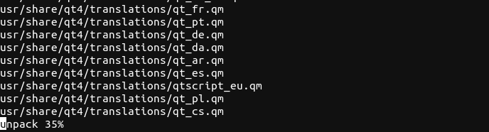
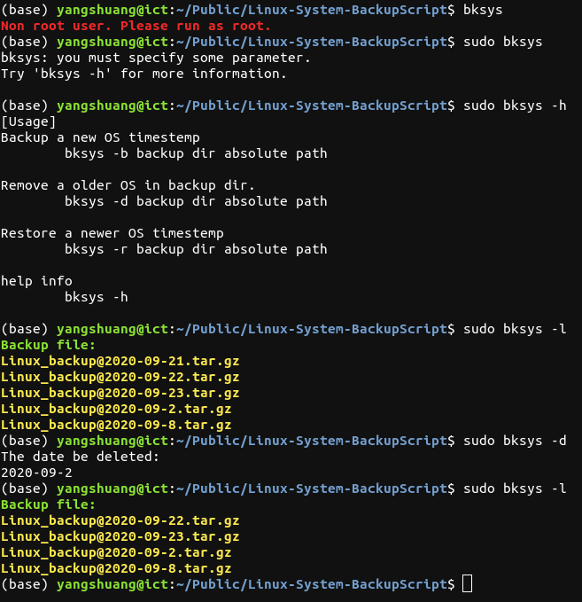

# Bksys - A system back up tools
  This is a System backup tool about Linux System.  
  I am user of ubuntu OS and I don\`t like dejagnu to backup my system.  
  Because I cannot use it to restore my system when I cannot access the graphical interface.  
  So this script came into being!
  
  ### Advantage
  **Small** - Based on tar packaging and compression, the backup file is small.  
  **Easy to manage** - Manage all backup files with a few simple commands.  
  **Command line** - Command line interface, very useful when the graphical interface crashes.  
  **Online recovery** - No need for livecd, No need to shut down!  

## How to backup your OS?
  - `cd Linux-System-BackupScript`  
  - `chmod +x ./install.sh`  
  - `sudo ./install.sh`    
  You may need to enter `storage path` here，this path is where you want to save the backup file.
  - `sudo bksys -b`
  
## Usage example

- You want to **backup** current system to the backup dir,  just run   
 &nbsp; &nbsp; &nbsp;  &nbsp; `sudo bksys -b`
 - You want to **restore** a newer system from the backup dir, just run  
 &nbsp; &nbsp; &nbsp;  &nbsp; `sudo bksys -r`
 - You want to **delete** a older system from the backup dir, just run  
&nbsp; &nbsp; &nbsp;  &nbsp;  `sudo bksys -d`
 - You want to **browse** the backed up system from the backup dir, just run  
 &nbsp; &nbsp; &nbsp;  &nbsp; `sudo bksys -l`
##  Feature
- Restore progress bar  
  
  
  
- Simply usage !  
  
  

## Licenses
  
  
  
